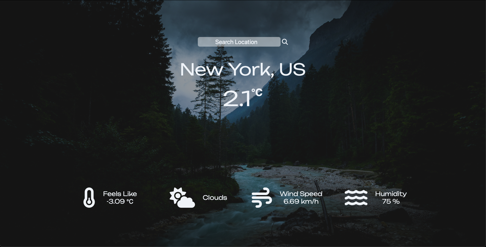

# Weather App

(***Image***)

## About
A simple weather app which shows the degrees (in celcius) as well as some additional weather information.

### Takeaways
The big thing to learn while making this project was how to work with APIs. It was also a good opportunity to deepen my understanding about what Webpack does and how it works. 

Code [here](github.com/nudd3/weather-app)
Live [here](asdkads)

The project is a part of [The Odin Project's](www.theodinproject.com) curriculum. 

## Technologies

The following was used to create the application:

* HTML
* CSS
* JavaScript
* Git
* Webpack
* [OpenWeatherApp API](OpenWeatherApp.com)

